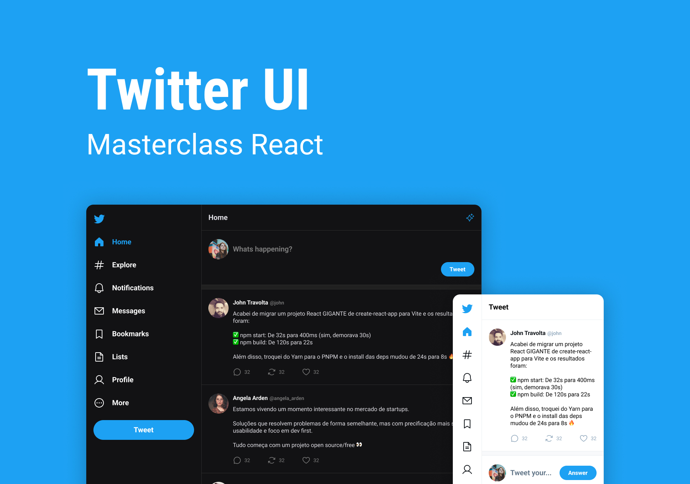

<h1 align="center"> Twitter UI </h1>

Projeto desenvolvido na masterclass de React feito pela Rocketseat

  <a href="#-tecnologias">Tecnologias</a>&nbsp;&nbsp;&nbsp;|&nbsp;&nbsp;&nbsp;
  <a href="#-projeto">Projeto</a>&nbsp;&nbsp;&nbsp;|&nbsp;&nbsp;&nbsp;
  <a href="#-layout">Layout</a>&nbsp;&nbsp;&nbsp;|&nbsp;&nbsp;&nbsp;

  

## 🚀 Tecnologias

Esse projeto foi desenvolvido com as seguintes tecnologias:

- ReactJS
- TypeScript
- ReactRouter
- Git e Github
- Figma

## 💻 Projeto

O Twitter UI é um clone da interface do twitter feito com React.

- [Acesse o projeto no github clicando aqui](https://github.com/HenriqueSC23/twitter-ui)

## 🔖 Layout

Você pode visualizar o layout do projeto através [DESSE LINK](https://www.youtube.com/redirect?event=video_description&redir_token=QUFFLUhqbm9HdnhOUjZQV2JwaWhRUzZlaG9NYUdjNC0tQXxBQ3Jtc0trLV9fSnlDR1RqVV9ZQThjdndyN3llNFlQV0dKUlZaSjZDUmE3bzExeFRBRjhsVXdXR0hweDVpNnZnVVprZzY3bFJFRlRmQ0NiVnM3Nko0YUcyX0loV2JrSlg5R1dzMHRiY25PMjZWamhjZjZnVm95RQ&q=https%3A%2F%2Fwww.figma.com%2Fcommunity%2Ffile%2F1202694130789327431&v=99okStmx-7c). É necessário ter conta no [Figma](https://figma.com) para acessá-lo.

